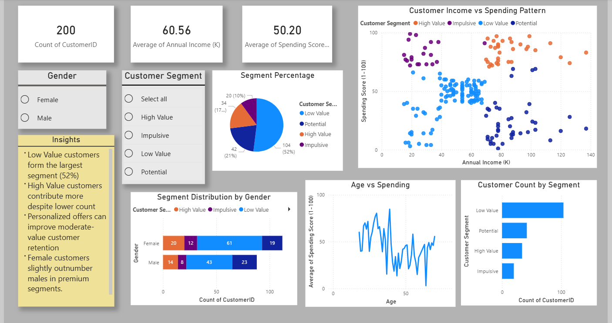

# 📊 Customer Segmentation Analysis Dashboard

## 🔍 Project Overview

This project analyzes customer behavior using demographic and spending data to identify valuable customer segments and support data-driven business decisions.

Using **Excel** for data cleaning and **Power BI** for dashboarding, customers were segmented based on income and spending behavior into actionable groups.

---

## 🎯 Business Objective

The goal of this project was to answer:

- Who are the most valuable customers?
- Which segment contributes the most spending potential?
- How can low-value customers be converted?
- What patterns exist across age, gender, and income?

---

## 🛠️ Tools & Technologies

- **Excel** – Data cleaning, formatting, preprocessing  
- **Power BI** – Dashboard development & DAX measures  
- **DAX** – Segment logic, KPIs, calculated columns

---

## 📂 Dataset Information

**Mall Customers Dataset**

Total Records: **200 Customers**

Features Used:

- CustomerID  
- Gender  
- Age  
- Annual Income (k$)  
- Spending Score (1–100)

---

## 🧠 Segmentation Logic

Customers were classified into 4 business segments:

| Segment | Definition |
|--------|------------|
| High Value | High Income + High Spending |
| Potential | High Income + Moderate/Low Spending |
| Impulsive | Lower Income + High Spending |
| Low Value | Lower Income + Lower Spending |

---

## 📈 Dashboard KPIs

| Metric | Value |
|------|------|
| Total Customers | 200 |
| Avg Annual Income | 60.56k |
| Avg Spending Score | 50.20 |
| Total Segments | 4 |

---

## 🔍 Key Insights Generated

### 📌 Segment Distribution

- **Low Value Customers:** 52%  
- **Potential Customers:** 21%  
- **High Value Customers:** 17%  
- **Impulsive Customers:** 10%

### 📌 Revenue Opportunity Insight

Although **High Value customers represent only 17%**, they show significantly stronger spending behavior and should be prioritized for retention.

### 📌 Growth Opportunity

The **52% Low Value segment** represents the largest untapped opportunity through promotions, loyalty campaigns, and upselling strategies.

### 📌 Behavioral Insight

Customers with similar income levels displayed different spending patterns, proving that income alone does not determine customer value.

---

## 📊 Dashboard Features

- Executive KPI Cards  
- Segment Distribution Charts  
- Income vs Spending Scatter Plot  
- Gender-based Analysis  
- Age vs Spending Trends  
- Interactive Filters / Slicers

---

## 💡 Business Recommendations

- Launch loyalty offers for High Value customers  
- Target Low Value customers with personalized discounts  
- Convert Potential customers using premium campaigns  
- Use behavioral targeting instead of income-only targeting

---

## 📷 Dashboard Preview

---

## 🚀 Outcome of This Project

This project demonstrates practical skills in:

✅ Data Cleaning  
✅ Customer Segmentation  
✅ Dashboard Storytelling  
✅ DAX Calculations  
✅ Business Insight Generation

---

## 👩‍💻 Author

**Ananna Das**  
Aspiring Data Analyst | Excel | SQL | Power BI  
LinkedIn: www.linkedin.com/in/ananna-das-091b9121a
